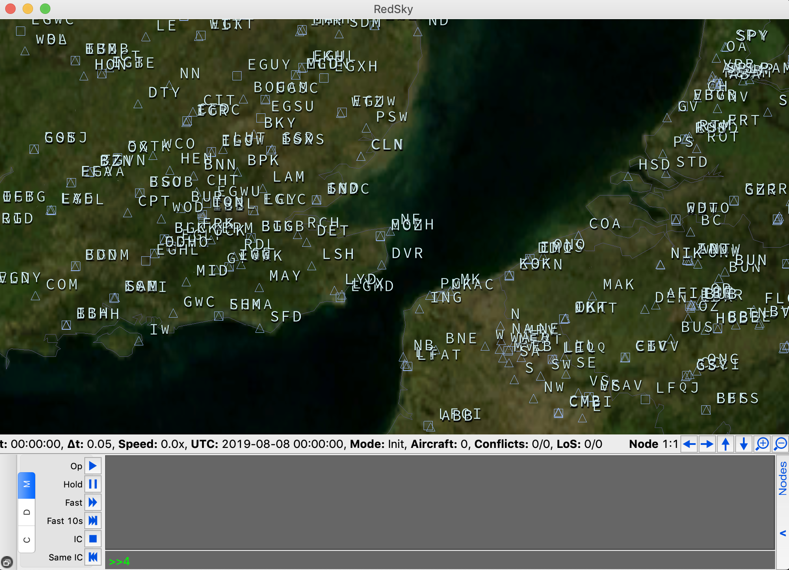

[](https://travis-ci.com/alan-turing-institute/simurgh)

# Simurgh

*Simugh* pronounced _Seymour_ is a project that aims to develop a research-focused
open source simulation platform, along with a user-friendly interface for
evaluating different machine learning algorithms for real-time decision-making,
from optimisation approaches to reinforcement learning, in a complex and
uncertain environment.

Air traffic control is a complex task requiring real-time planning under
uncertainty, predicting potential conflicts and issuing commands to aircraft
pilots to ensure safety. This project investigates machine learning methods that
can be applied to this domain and could in future help air traffic controllers
in effective decision-making. Using simulations similar to training scenarios
for actual air traffic controllers, the project builds an open experimentation
platform to evaluate possible machine learning approaches to this task, and
explores algorithms to 'play' the simulation in the role of air traffic
controllers.

The [Simurgh](https://en.wikipedia.org/wiki/Simurgh) project contains several
elements that all work together to achieve the aims laid out above; these are:

- [Bluesky](https://github.com/alan-turing-institute/bluesky) - open source air traffic simulator

- [Bluebird](https://github.com/alan-turing-institute/bluebird) - server that handles communication between Bluesky and air traffic control agents

- [Twitcher](https://github.com/alan-turing-institute/twitcher) - front-end for monitoring the simulation

- [Dodo](https://github.com/alan-turing-institute/dodo) - scaffolds for ATC agents in Python, R, and potentially other languages

## Quick Start

If one has Docker installed, perhaps the most "hassle free" option would be to run:

```
docker-compose up -d
```

This will pull down the pre-built images from DockerHub and
start each container in order. Then all one needs to do is go to
`http://localhost:8080` where Twitcher will be running.

_Note_: If this is the first time running this command, it may take some time to
download and extract all the layers involved.

Then to close this, run:

```
docker-compose down
``` 

This will shutdown the running instances.

# Installation

In order to get things up and running, it is important to emphasise the
dependencies tree of the packages outlined above. When cloning `simugh` be sure
to run:

```bash
git clone --recurse-submodules -j8 git@github.com:alan-turing-institute/simurgh.git
```


A full step-by-step installation guide can be found
at:https://alan-turing-institute.github.io/simurgh/

However, if one would like to get up and running immediately this set of
commands will install all dependencies and start the application using Docker by
running:

```bash
source install.sh
```

This will create a conda environment call `nats` and install all necessary
dependencies required. Please see User Guide for how to get going.

## Bluesky

Original instructions can be found on:

However, it has been found to be much easier to have `environment.yml` file instead.
```bash
# This file may be used to create an environment using:
# $ conda env create --name <env> --file <this file>
# platform: linux-64
name: nats

channels:
  - conda-forge

dependencies:
  - python=3.6
  - pyqt
  - numpy
  - scipy
  - matplotlib
  - pandas
  - r-base

  - pip:
    - flask
    - flask_cors
    - flask_restful
    - markdown
    - msgpack
    - python-dotenv
    - pyzmq
    - pygame
    - pyproj    # birdhouse dep
    - pyqtwebengine
    - pyopengl
    - pyopengl-accelerate
    - psutil==5.5.*
    - pytest==4.1.*
    - pylint==2.2.*
    - pylint-exit==1.0.*
```

```bash
conda env create -q && conda activate nats
```

Now that dependencies are install for both Bluesky & Bluebird, we can at least
check that these are OK by running `check.py` inside the Bluesky repository.

Running `python bluesky/check.py `will produce the following output:

```bash
(nats) $$ python bluesky/check.py
This script checks the availability of the libraries required by BlueSky, and
the capabilities of your system.

Checking for numpy               [OK]
Checking for scipy               [OK]
Checking for matplotlib          [OK]
Checking for pyqt                [QT5]
Checking for pyopengl            [OK]
OpenGL module version is         [3.1.0]
Checking GL capabilities         [OK]
GL Version at least 3.3          [OK]
Supported GL version             [4.1]
Checking for pygame              pygame 1.9.6
Hello from the pygame community. https://www.pygame.org/contribute.html
[OK]

You have all the required libraries to run BlueSky. You can use both the QTGL
and the pygame versions.
Checking bluesky modules
StateBasedCD: using Python version.
Could not import pyclipper, RESO SSD will not function
Using Open Aircraft Performance (OpenAP) model
Successfully loaded all BlueSky modules. Start BlueSky by running BlueSky.py.

```

The above command only checks the dependencies for Bluesky, if it was indeed
successful, we can now install Bluesky into the Python path with:

```bash
(nats) $$ pip install bluesky/
```

From here, all the necessary items should be installed, Bluesky can now be
launched with:
```bash
(nats) $$ cd bluesky && python Bluesky.py
```

The above command will start the Bluesky simulator with the in built GUI which
looks like:



If one would like to run Bluesky _without_ the default GUI, a headless version
is available with the command:

```bash
(nats) $$ cd bluesky && python Bluesky.py --headless
```

If perhaps the user wished to connect the running instance to a remote host this
can be done with:

```bash
(nats) $$ cd bluesky && python BlueSky.py --client --bluesky_host=1.2.3.4
```
This will skip discovery and attempt a connection to the specified host (using
the default ports)

Now that the instance of the simulator is up and running and connected to the
desired ports, one can now spin up Bluebird, which is the interface layer
between the simulator and the AI agents.

## Bluebird

If Bluesky was install successfully, then it should be as simply as doing:
```bash
(nats) $$ cd bluebird && python run.py
```
This should produce the following output:
```bash
2019-08-08 18:08:31 INFO     bluebird.bluebird: Connecting to client...
Client 0b06b30f connected to host 5dd3f7f1 of version 1.2.1
2019-08-08 18:08:41 INFO     bluebird.cache.sim_state: speed=0x, ticks=   0, time=, state=INIT, aircraft=0
2019-08-08 18:08:41 INFO     bluebird.cache.sim_state: Logging started. Initial SIM_LOG_RATE=0.2
Client active node changed.
 * Serving Flask app "bluebird.api" (lazy loading)
 * Environment: production
   WARNING: This is a development server. Do not use it in a production deployment.
   Use a production WSGI server instead.
 * Debug mode: on
 * Running on http://0.0.0.0:5001/ (Press CTRL+C to quit)
2019-08-08 18:08:46 INFO     bluebird.cache.sim_state: speed=0.0x, ticks=   0, time=00:00:00, state=INIT, aircraft=0

```

Now we have the simulator running, and the interface that sits on top, we can
now connect our AI agents.

## DoDo


Here

```bash
git clone https://github.com/alan-turing-institute/dodo.git
cd dodo/Pydodo
pip install .
```

```python
>>> import pydodo
>>>
>>> pydodo.reset_simulation()
True
>>>
```
Success!

## Twitcher (Optional)

## Run all together

* SPIN UP
```bash
( cd bluesky && python Bluesky.py --headless ) &
( cd bluebird && python run.py )
```

* TEAR DOWN
```bash
<CTRL>-C
fg
<CTRL>-C
```
The tear down output will look similar to:

```bash
 * Serving Flask app "bluebird.api" (lazy loading)
 * Environment: production
   WARNING: This is a development server. Do not use it in a production deployment.
   Use a production WSGI server instead.
 * Debug mode: on
Client active node changed.
 * Running on http://0.0.0.0:5001/ (Press CTRL+C to quit)
2019-08-09 13:28:40 INFO     bluebird.cache.sim_state: speed=0.0x, ticks=   0, time=00:00:00, state=INIT, aircraft=0
^C2019-08-09 13:28:43 INFO     bluebird.bluebird: BlueBird stopping
(nats) $$ fg
( cd bluesky && python Bluesky.py --headless )

^C# Node(9ca92ee2): Quitting (KeyboardInterrupt)
# Server quitting (KeyboardInterrupt)
# Server: Main loop exit. Waiting for spawned processes to exit...
# Server: Spawned processes joined. Server stopping
```

## Documentation

The documentation for this project can be found at https://alan-turing-institute.github.io/simurgh/
Alternatively one can build and view these locally if one has `mkdocs`
installed. To do this, in the top level of this repository, run:

```bash
mkdocs serve
```

The corresponding _readthedocs_ can be found on `localhost:8000`

NOTE. If files are removed from 'docs/' in between builds, they make
still hang around, a better command to run would be:

```bash
mkdocs build --clean
```

When docs have been built, they can then be deployed online to the public facing
project page [here](https://alan-turing-institute.github.io/simurgh/) with the
following command:
```bash
mkdocs gh-deploy
```
This will produce the following output:
```bash
INFO    -  Cleaning site directory
INFO    -  Your documentation should shortly be available at: https://alan-turing-institute.github.io/simurgh/
```

## Troubleshooting

## Testing


