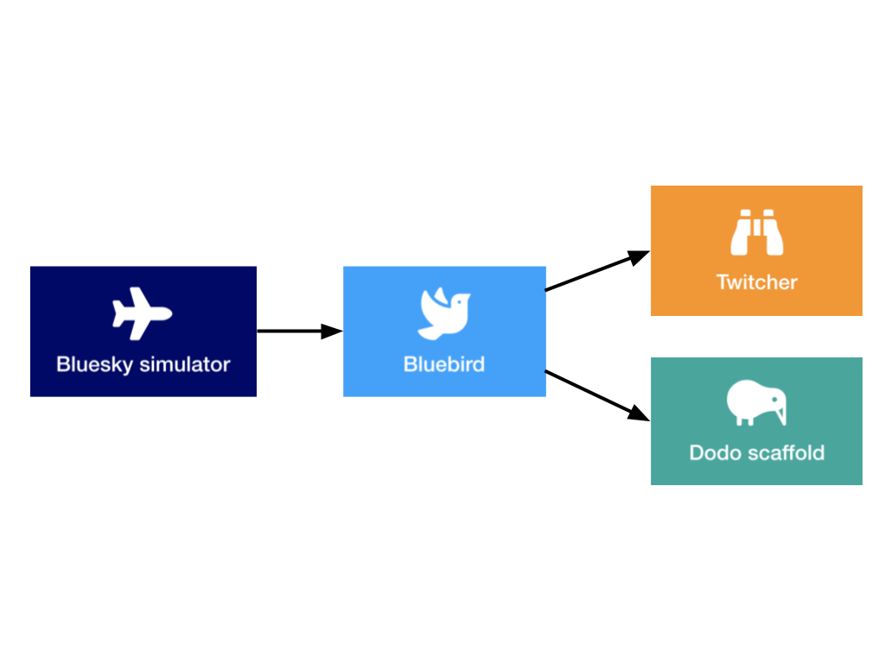

[](https://travis-ci.com/alan-turing-institute/simurgh)

# Simurgh

*Simurgh* (pronounced _Seymour_) is an open source platform that supports developing
and evaluating algorithms (AI agents) for automated air traffic control. It provides
an easy to use interface for running experiments in an air traffic simulator as well as packages that support agent development.

## Table of contents

- [Project overview](#project-overview)
- [Quick start](#quick-start)
- [Example usage](#example-usage)
- [Contributing](#contributing)

## Project overview

Air traffic control (ATC) is a complex task requiring real-time safety-critical decision
making. In practice, air traffic control operators (ATCOs) monitor a given sector and issue commands
to aircraft pilots to ensure safe separation between aircraft. They also have to consider
the number and frequency of instructions issued, fuel efficiency and orderly handover between sectors.
Optimising for the multiple objectives while accounting for uncertainty (e.g., due to aircraft mass, pilot behaviour or weather conditions) makes this a particularly complex task.

The [Simurgh](https://en.wikipedia.org/wiki/Simurgh) project provides a research-focused user-friendly
platform for testing automated approaches to ATC. It consists of several elements that
all work together to achieve this:



- [Bluebird](https://github.com/alan-turing-institute/bluebird) - a Flask-based API that handles communication with multiple air traffic simulators (it supports the open source [Bluesky](https://github.com/alan-turing-institute/bluesky) simulator)

- [Aviary](https://github.com/alan-turing-institute/aviary) - package for generating ATC scenarios and performance evaluation metrics (dependency of Bluebird)

- [Dodo](https://github.com/alan-turing-institute/dodo) - scaffold for building ATC agents, which provides commands for communicating with BlueBird in Python (PyDodo) and R (rdodo)

- [Twitcher](https://github.com/alan-turing-institute/twitcher) - front-end for BlueBird for monitoring the simulation

With an ATC simulator (e.g., BlueSky) and BlueBird running, one can observe and interact with the simulation via BlueBird using Python (PyDodo), R (rdodo) or Twicher. The aviary package allows one to synthetically generate ATC scenarios of increasing complexity to train agents on and provides metrics to score performance.

## Quick Start

The above figure shows the dependency flow. One needs to have BlueSky running before BlueBird can operate.
Twicher and Dodo similarly require BlueBird to be running in order to work.

### 1. Clone this repository

Clone the repo:

```{bash}
git clone https://github.com/alan-turing-institute/simurgh.git
```

All commands described in the subsequent sections are meant to be run from inside the repo. After cloning the repo make sure to run:

```{bash}
cd simurgh
```

### 2. Run BlueBird and BlueSky (& Twicher) with Docker

The easiest way to run BlueBird and BlueSky is through [Docker](https://www.docker.com).

If you have Docker installed and have cloned this repo then run:

```{bash}
docker-compose up -d
```

This pulls down the pre-built images from DockerHub and
starts each container in the right order.

Then all one needs to do is go to
`http://localhost:8080` where Twitcher will be running.

_Note_: If this is the first time running this command, it may take some time to
download and extract all the layers involved.

Then to close this, run:

```
docker-compose down
```

This will shutdown the running instances.

### 3. Install PyDodo

PyDodo is the Python implementation of Dodo.

To install:

```bash
git clone https://github.com/alan-turing-institute/dodo.git
pip install dodo/Pydodo
```

If BlueSky and BlueBird are running (see previous step), then one can communicate with the simulator (via
BlueBird) using PyDodo:

```python
>>> import pydodo
>>>
>>> pydodo.reset_simulation()
True
>>>
```

Success!

See the Dodo [specification document](https://github.com/alan-turing-institute/dodo/blob/master/Specification.md) for a detailed overview of the supported commands.

## Example usage

The [example notebook](examples/Example-pipeline.ipynb) shows how to interact with the simulation using PyDodo.

To run the example, launch the notebook using the command below (this will automatically open the notebook in your browser):

 ```{bash}
 jupyter lab examples/Example-pipeline.ipynb
 ```

## Contributing

🚧The project is still under development. å🚧

We welcome contributions to all elements of the project.

You can either help improve the overall documentation here or go to the repository for the part of the project you want to contribute to:
- [Bluebird](https://github.com/alan-turing-institute/bluebird)
- [Twitcher](https://github.com/alan-turing-institutetwitcher)
- [Dodo](https://github.com/alan-turing-institute/dodo)
- [Aviary](https://github.com/alan-turing-institute/aviary)
