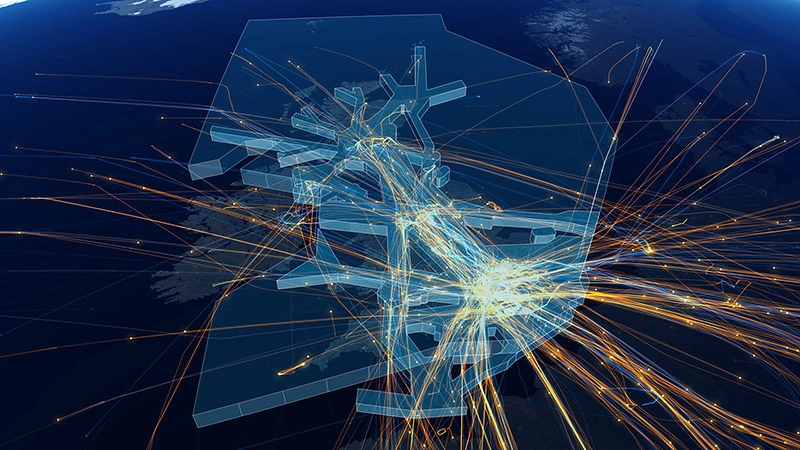
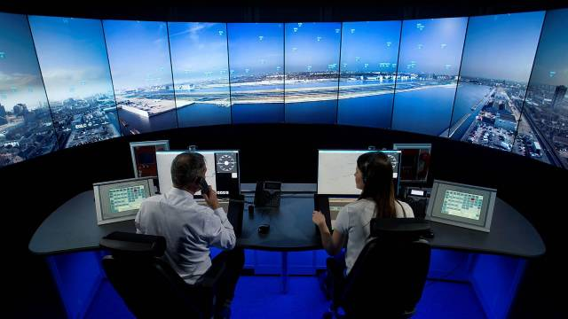
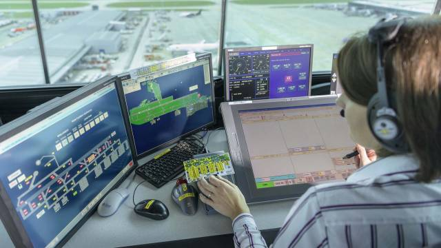
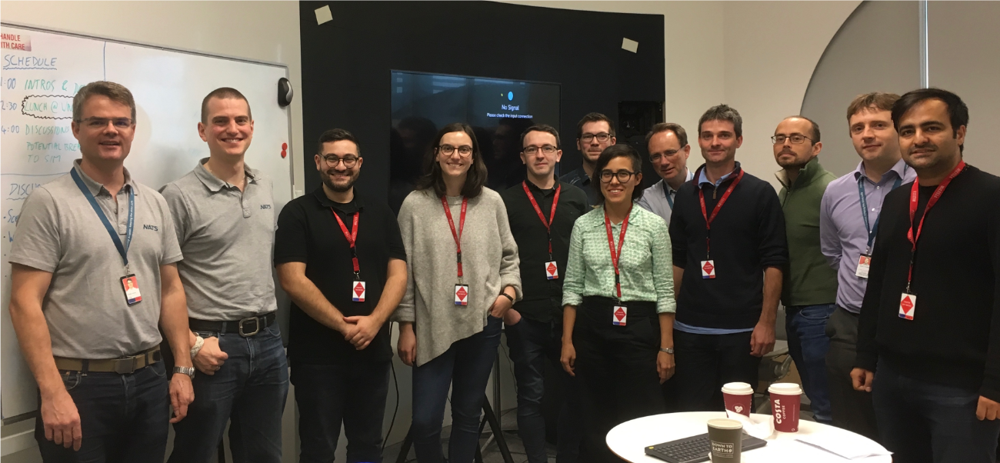

# Simulation platform for AI for air traffic control

Simurgh is an open source simulation platform for AI experimentation and research for air traffic control. We aim to inspire development of AI algorithms that can perform tactical air traffic control and augment human performance in this area. 

##### Simurgh - behind the name

Simurgh (pronounced _Seymour_) is a mythical bird from Persian folklore and literature. She is very old and wise because she has learned over years and accummulated the knowledge of all the ages. This way, the project name represents the machine learning goal of learning through observations and experiments, and distilling the experience into algorithms that can be used to help humans in practice. 

[Read more about *simurgh* on Wikipedia](https://en.wikipedia.org/wiki/Simurgh).

  
*UK airspace visualisation, Image courtesy of NATS Press Office.*

## About the project

This project is a collaboration between [The Alan Turing Institute](https://www.turing.ac.uk), UK's national institute for data science and AI, and [NATS](htttps://www.nats.aero), UK's leading air traffic control provider.
In the Turing, the project is a part of the [Data-centric Engineering Programme](https://www.turing.ac.uk/research/research-programmes/data-centric-engineering), led by [Professor Mark Girolami](https://www.turing.ac.uk/people/researchers/mark-girolami).

<nav class="level">
    

        

        <figure class="image is-128x128">
            
        </figure>
        

    

    

        

            <figure class="image is-128x128">
                
            </figure>
        

        

</nav>

The Turing’s deep collaboration with NATS began in 2018 through the Turing’s Data-centric Engineering (DCE) programme. One of the main aims was to explore the performance of AI-based air traffic control agents, and in doing so provide critical insights for the development of new air traffic control (ATC) tools and decision aids. 

Simurgh is an open source ATC simulation and experimentation platform.

##### Key features

- Simurgh interfaces with existing open source air traffic simulator [**BlueSky**](https://github.com/TUDelft-CNS-ATM/bluesky), developed at TU Delft
- Integrates with [OpenAI gym](https://gym.openai.com/), providing a familar interface for reinforcement learning research.
- Provides tools to generate scenarios for air traffic control that are both *realistic* and *relevant* for real-world operations.
- Uses evaluation criteria for AI agents that mimic some of the performance metrics used for human air traffic controllers.
 

  

    <a href="https://www.turing.ac.uk/research/impact-stories/putting-ai-air-traffic-control">
      

        

          <figure class="image is-4by2">
            
          </figure>
        

        

          
Impact story: Putting the AI in air traffic control

          
The Alan Turing Institute

          

            
The UK’s leading air traffic control provider, NATS, has teamed up with the Turing to explore how the industry can evolve with machine learning

          

        

      

    </a>
  

  

    <a href="https://www.turing.ac.uk/research/research-projects/decision-making-under-uncertainty-air-traffic-control">
      

        

          <figure class="image is-4by2">
            
          </figure>
        

        

          
Turing website: Decision-making under uncertainty in air traffic control

          
The Alan Turing Institute

          

            
Investigating machine learning methods to support air traffic controllers

          

        

      

    </a>
  
  

## Meet the team

In the Turing, the team involved in the project is part of the [Research Engineering Group](https://www.turing.ac.uk/research/research-engineering) that, as a part of its mission, focuses on connecting academic research with real-world applications. The members of the team are professional research software developers and research data scientists. The project included also a collaboration with research engineering from [EPCC in Edinburgh](https://www.epcc.ed.ac.uk/).
The team was closely working with the research team at NATS.

